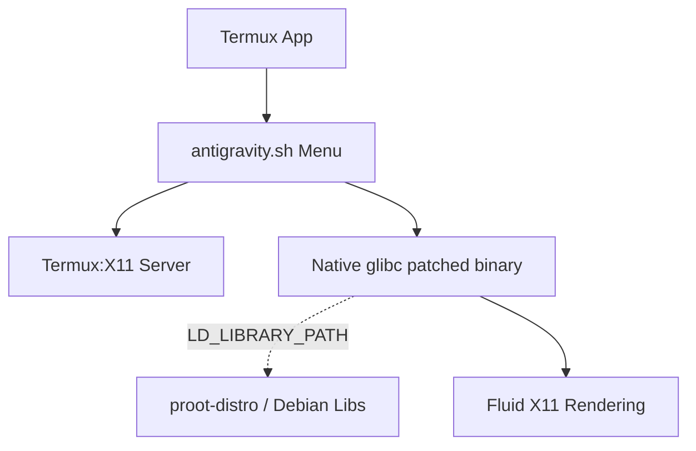

# 🌌 Termux-Antigravity

<div align="center">

[](LICENSE)
[](https://android.com)
[](https://termux.dev/)

> **Google Antigravity IDE natively on Android with Termux.**  
> Utilizes a native glibc patch to bypass `proot-distro` container overhead at runtime, achieving unprecedented X11 fluidity.  
> *Ejecuta Google Antigravity nativamente usando un parche glibc que libera toda la fluidez de X11.*

</div>

---

## 🌎 Language Support / Soporte de Idioma

This project supports **English** and **Spanish**. The installer and main menu automatically detect your system language. You can also toggle the language directly from the main menu at any time!

*Este proyecto soporta **Inglés** y **Español**. El instalador y el menú principal detectan automáticamente el idioma de tu sistema. ¡También puedes cambiar el idioma directamente desde el menú principal en cualquier momento!*

---

## ⚡ Installation / Instalación

Run the following command in Termux:  
*Ejecuta el siguiente comando en Termux:*

```bash
curl -H 'Cache-Control: no-cache' -o installantigravity.sh \
  https://raw.githubusercontent.com/kuromi04/termux-antigravity/main/installantigravity.sh \
  && chmod +rwx installantigravity.sh \
  && ./installantigravity.sh \
  && rm installantigravity.sh \
  && clear
```

Once completed, the main menu will open automatically.  
*Al terminar, el menú principal se abrirá automáticamente.*

---

## 🚀 Usage / Uso

Open the interactive menu anytime with:  
*Abre el menú interactivo en cualquier momento con:*

```bash
./antigravity.sh
```

### Menu Options / Opciones del menú

1. **Start Antigravity / Iniciar Antigravity**: Launches the X11 server and the native glibc patched IDE.
2. **Re-run Installer / Reinstalar**: Re-runs the installation process and updates files.
3. **Stop and clean session / Detener y limpiar**: Kills background X11 and PulseAudio processes cleanly.
4. **Uninstall / Desinstalar**: Safely removes all installed files.
5. **Toggle Language / Cambiar Idioma**: Switch between English and Spanish.

---

## 🏗️ Architecture: Native glibc execution

Termux-Antigravity now implements **a new native glibc patching method**! ("la nueva forma de parche q abra fluidez en X11")  
Instead of running the entire IDE inside a `proot-distro` container which introduces substantial overhead, we use Termux's `glibc-repo` and `patchelf-glibc` to run the ARM64 binary directly on Termux, only using `proot-distro` to borrow missing Debian libraries via `LD_LIBRARY_PATH`.



### 📋 Requirements / Requisitos

| Component / Componente | Minimum / Mínimo | Recommended / Recomendado |
|------------------------|-----------------|---------------------------|
| **SoC**                | Snapdragon 700  | Snapdragon 8+ Gen 1+      |
| **RAM**                | 6 GB            | 8 GB+                     |
| **Storage / Almacen.** | 4 GB free       | 8 GB free                 |
| **Android Version**    | Android 10+     | Android 12+               |

**Required Apps / Apps Requeridas:**
- [Termux](https://github.com/termux) (from GitHub, NOT Play Store)
- [Termux:X11](https://github.com/termux/termux-x11/releases)

---

## 🔧 Troubleshooting / Solución de Problemas

- **Black screen on Termux:X11 / Pantalla negra en Termux:X11**  
  Ensure the Termux:X11 app is open in the background before selecting "Start" in the menu.  
  *Asegúrate de que la app Termux:X11 esté abierta antes de elegir "Iniciar".*

- **X11 Server did not respond / El servidor X11 no respondió**  
  You may need to manually start Termux:X11. Clean your session using option 3 in the menu and try again.  
  *Limpia la sesión usando la opción 3 en el menú y vuelve a intentar.*

---

## 💜 Credits / Créditos

- **[ivam3](https://github.com/ivam3)** — For the guidance and the [ivam3bycinderella](https://github.com/ivam3) community.
- **Termux Community** — For maintaining an incredible Linux ecosystem on Android.
- Developed with 💜 by **[@maka0024 · kuromi04](https://github.com/kuromi04)**
